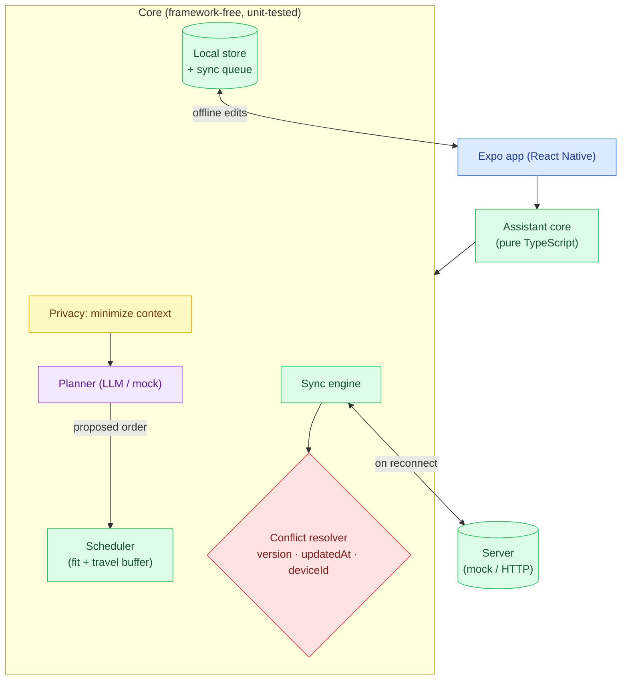
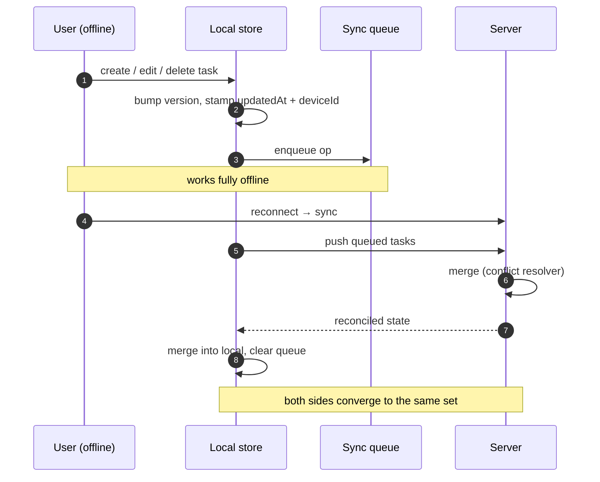

# Mobile Life Assistant

**▶ Live demo: https://parag-labs.github.io/mobile-assistant/** — the Expo app exported to the
web, running entirely in your browser (the engine is pure, deterministic TypeScript; no
backend, no API key). On a phone it runs natively via Expo Go / a dev build.

An **offline-first** React Native / Expo AI assistant. Tell it how long you have —
*"I have 45 minutes before I leave"* — and a planner **proposes** an ordering of your tasks;
deterministic code then **fits it to the window and reserves a travel buffer**. Every task edit
works offline and **syncs with deterministic conflict resolution** when you reconnect.

> The AI proposes an ordering. Deterministic code validates it against the time window,
> reserves a travel buffer, and never lets you overrun.

For *"I have 45 minutes"* it produces exactly the spec's worked example:

```
Prepare bag     8 min
Task B         10 min
Task A         15 min
Travel buffer  11 min       (Deep work block deferred — doesn't fit)
```

---

## Problem

Two hard things sit under a friendly assistant:

1. **A planner you can trust with your time.** An LLM that orders tasks can be wrong or
   over-eager. Here the model only *proposes* an order; a deterministic scheduler decides what
   actually fits and always reserves a travel buffer, so the plan can never make you late.
2. **Offline-first sync that converges.** You edit tasks on a plane; the same task was edited on
   your laptop. On reconnect the two must reconcile to **one** answer, **identically on every
   device**, with no coordination. This project uses a documented, totally-ordered conflict
   resolver so the stores always converge.

## Demo

Web (what the live link runs):

```bash
npm install
npm run web        # opens the Expo web build
```

Native (phone or simulator):

```bash
npm start          # scan the QR code with Expo Go
```

Try it: set the minutes and hit **Plan**; add/complete/delete tasks; flip **Online → Offline**,
make edits (they queue), flip back and **Sync now** — the status reports how many changes moved
and how many conflicts were resolved. **Delete my data** wipes the local store.

Reproduce the evaluation numbers:

```bash
npm run eval
```

## Architecture



The Expo UI is a thin shell. All the logic — planning, scheduling, storage, sync, conflict
resolution, privacy — lives in `src/core`, a pure-TypeScript module with no React Native
imports, which is why it is fully unit-tested and runs identically on device and web.

## Offline & sync flow



## Conflict resolution (the documented strategy)

When the same task id was edited on two devices, the resolver picks a single winner with a
**three-level total order** (`src/core/conflict.ts`):

1. **version** — the higher monotonic version wins (more edits on top of a common base);
2. **updatedAt** — if versions tie, the later wall-clock write wins (last-writer-wins);
3. **deviceId** — if both tie, the lexicographically smaller device id wins.

Level 3 is the important one. Without a final, globally-unique tiebreak, two truly simultaneous
edits could resolve *differently* on different devices and the stores would diverge forever.
`deviceId` is arbitrary but stable and unique, so **every device computes the same winner** and
the outcome never depends on which side you call "local" or "remote". `resolve(a, b)` and
`resolve(b, a)` always agree — a property the tests assert directly.

## TypeScript design

- **Branded IDs** (`TaskId`, `DeviceId`) so the two id kinds can't be mixed up.
- **A serializable task model** with explicit sync metadata (`version`, `updatedAt`,
  `deviceId`) and a hand-rolled `parseTask` validator at the storage/peer boundary.
- **A `Planner` interface** with a deterministic `MockPlanner` (and `ScriptedPlanner` for
  adversarial tests); a real model drops in without touching the scheduler.
- **A typed event union** (`PlanEvent`) for an observable planning run.
- **Pure, deterministic core**: injected clock, no `Math.random()`, no RN imports — so the eval
  numbers are reproducible and the module is trivially testable.

## Privacy

The spec's "only send necessary context to the AI service" is enforced in code
(`src/core/privacy.ts`): before any task reaches the planner it is **minimized** to exactly
three fields — `id`, `title`, `minutes`. Timestamps, the device id, status, and the deleted
flag never cross the AI boundary, and completed/deleted tasks are excluded entirely. A test
spies on the planner and asserts it only ever receives allowed fields. The app also has a
**Delete my data** operation that wipes the local store and queue.

## Evaluation

Produced by `npm run eval` from real runs — never hand-written. The safety metric is
**over-budget** (plans whose scheduled work plus travel buffer exceed the window): always 0,
even when the planner proposes a deliberately bad order.

| Scenario             | Status  | Scheduled | Deferred | Used min | Buffer | Over-budget | Tokens |
|----------------------|---------|-----------|----------|----------|--------|-------------|--------|
| 45 min (mock)        | planned | 3         | 1        | 33       | 11     | 0           | 20     |
| 20 min (tight)       | planned | 1         | 3        | 8        | 5      | 0           | 20     |
| 45 min (adversarial) | planned | 3         | 1        | 33       | 11     | 0           | 10     |

The adversarial row uses a planner that puts the 40-minute task first; the scheduler still keeps
the plan within the window (0 over-budget).

## Local setup

Requirements: Node 20+. No API keys, no backend.

```bash
npm install
npm run web        # Expo web
npm start          # native (Expo Go)
npm test           # core engine tests (Vitest)
npm run typecheck
npm run lint
npm run eval
npm run build      # static web export → dist/
```

## Docker

```bash
docker compose up --build   # http://localhost:3000
```

Builds the static web export and serves it with nginx. No secrets.

## Testing

The pure-TS core is covered by Vitest — 32 tests:

- **Conflict resolution** — every level of the total order, order-independence, merge.
- **Offline store & sync** — offline CRUD, queue, two-device convergence, idempotent re-sync,
  deletion propagation, data wipe.
- **Scheduler** — travel-buffer policy, the 45-minute example, and the never-exceed-window
  invariant across many window sizes.
- **Planner orchestrator** — worked example, adversarial-order safety, empty/failure paths.
- **Privacy** — minimization strips all but the allowed fields; a spy proves the planner never
  sees more.
- **Evaluation** — repeatable scored scenarios asserting 0 over-budget plans.

```bash
npm test
```

CI runs on the deterministic mock planner — no API keys.

## Roadmap

- Persist the local store to SQLite / AsyncStorage on device (the store is already behind an
  interface).
- Real push notifications for the "time to leave" buffer, and background sync.
- Calendar integration to derive the available window automatically.
- A real model behind the `Planner` interface, and on-device inference experiments.
- Location-aware travel-buffer estimation.

## Layout

```
mobile-assistant/
├── src/core/                   # pure-TypeScript engine (no RN imports, fully unit-tested)
│   ├── ids.ts                  # branded id types
│   ├── task.ts                 # task model + validator
│   ├── conflict.ts             # deterministic total-order conflict resolver + merge
│   ├── store.ts                # offline local store + sync queue
│   ├── sync.ts                 # bidirectional sync engine + mock server
│   ├── llm.ts                  # planner abstraction (MockPlanner / ScriptedPlanner)
│   ├── privacy.ts              # data minimization for the AI boundary
│   ├── schedule.ts             # deterministic fit-to-window + travel buffer
│   ├── events.ts               # typed event union + EventLog
│   ├── orchestrator.ts         # plan(): minimize → propose → schedule → verify
│   ├── evaluate.ts             # scored scenarios (0 over-budget)
│   ├── examples.ts             # sample tasks (the 45-minute example)
│   ├── eval-cli.ts             # `npm run eval`
│   └── __tests__/              # 32 Vitest tests
├── app/                        # Expo Router screens (thin UI over the core)
│   ├── _layout.tsx
│   └── index.tsx               # planner + offline tasks + sync + delete-my-data
├── app.config.js               # Expo config (Pages base URL gated on PAGES=1)
├── ARCHITECTURE.md
├── SECURITY.md
├── CONTRIBUTING.md
├── CHANGELOG.md
├── Dockerfile
└── docker-compose.yml
```

## License

MIT — see [LICENSE](LICENSE).
